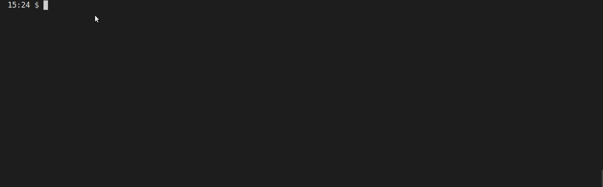
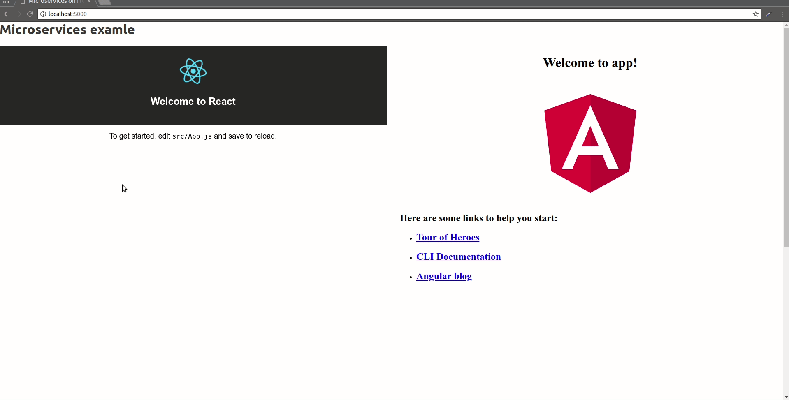

# Microservices at frontend

This repository contains plain example of microservice on frontend using _Docker_, _Nginx_ and _IFrame_  used as a tools to bring together both React and Angular in single page.

# To run

```bash
docker-compose up
```
aaaaand wait a little bit.



Now you can go to

http://localhost:5000

